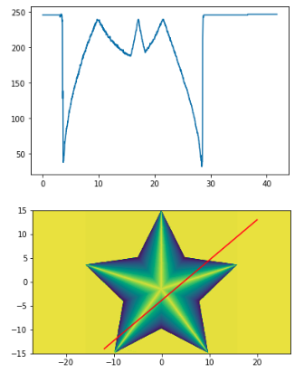
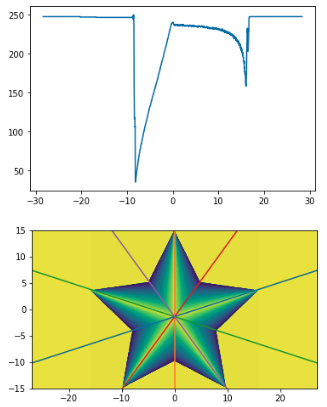

# Arbitrary Linecut, and Radial Linecuts Averaging
Extract arbitrary line cut with given terminals and radial linecuts with given center point efficiently. All codes are included in fastLinecut_radialLinecut.ipynb. 
## Arbitray Linecut
Given point 1 (pt1) and point 2 (pt2) coordinates, it can take the linecut between the two points efficiently, without using slower scipy package(s). Basically, any pair of coordinates between point 1 (pt1) and point 2 (pt2) can be converted to x- and y- pixel integers, so we don't need any interpolation, which speeds up the running.
For example: given two coordinates:
pt1 = (-12, -14),
pt2 = (20, 13),
we can take the linecut between the two points of the star image:

## Radial Linecuts Averaging
For example: given a center point center = (0, -1.4), a number of lines accross the center point numLines = 5, and a starting angle offset angleOffsetDegree = 18 due to the shape of star, it can take the average of 5 lines spaced equally in angles. The code can automatically determine edge points of different lines and take the overall average accordingly though they may have different lengths.

